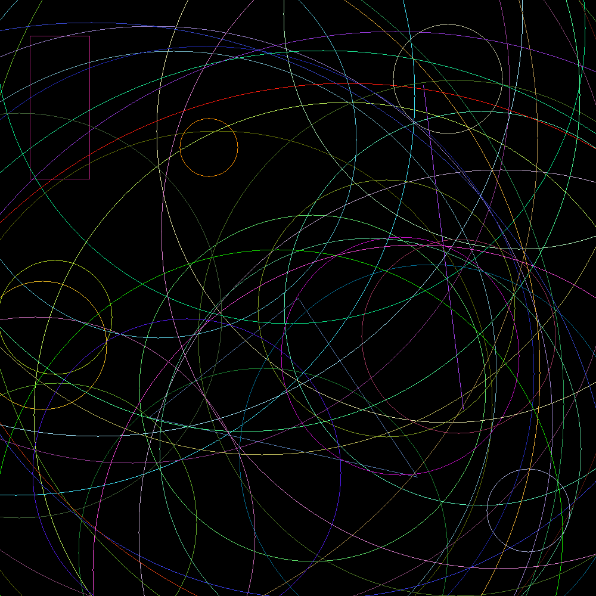

# Geometrical Shapes in Rust

This Rust project draws random geometric shapes (lines, circles, rectangles, triangles, and points) on a blank canvas using the `raster` and `rand` crates.

## Preview

Example output from the program:



## 🛠️ Run the Code

1. Add dependencies in `Cargo.toml`:

```toml
[dependencies]
raster = "0.2"
rand = "0.8"```

2. Run the project:

```cargo run```