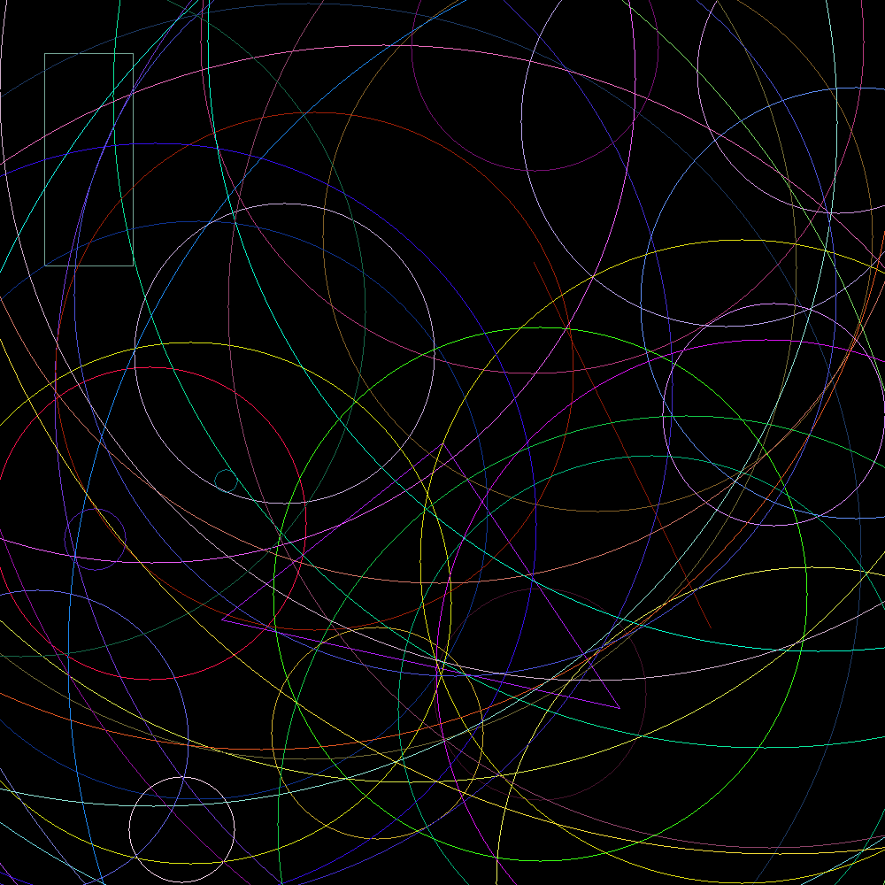

# Geometric Shapes Drawer in Rust

This Rust project generates PNG images by drawing various geometric shapes (points, lines, rectangles, triangles, and circles) with random colors and positions using the `raster` and `rand` crates.

## Features

- **Random Generation**:
  - Random positions within canvas bounds
  - Random RGB colors for each shape
  - Random circle radii
- **Drawing Algorithms**:
  - DDA algorithm for lines
  - Bresenham's algorithm for circles

### Shape Implementations
- **`Point`**: Single pixel at (x,y)
- **`Line`**: Connects two points using DDA algorithm
- **`Rectangle`**: Drawn using four connecting lines
- **`Triangle`**: Drawn using three connecting lines
- **`Circle`**: Rendered using Bresenham's circle algorithm

## Output Example


*(Actual output will vary due to random generation)*

## Dependencies
1. Add dependencies in `Cargo.toml`:

- `raster` = "0.2.0" (image manipulation)
- `rand` = "0.9.2" (random generation)

## 🛠️ Run the Code

```cargo run```